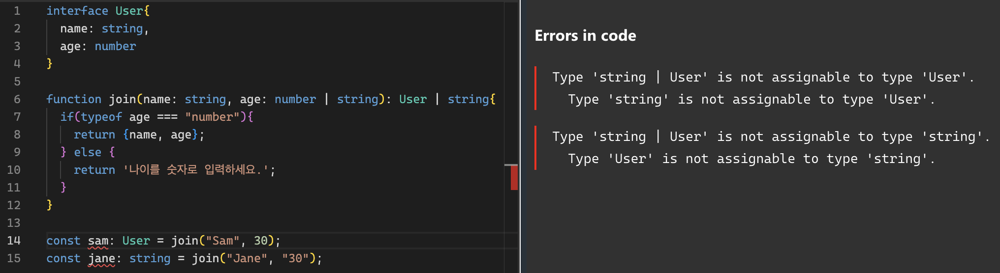

# 함수

## 함수 정의

```ts
function add(x: number, y: number): number {
  return x + y
}

let myAdd = function (x: number, y: number): number {
  return x + y
}
```

📍 아무것도 리턴해주지 않으면? `void`

```ts
function add(x: number, y: number): void {
  console.log(x + y)
}
```

## 함수 타입 선언

type 별칭 및인터페이스 역시 개별적으로 함수타입을 선언하여 사용될 수 있다.

```ts
//* type 리터럴로 함수 타입을 지정
type Add1 = (x: number, y: number) => number
let myFunc6: Add1 = (x, y) => {
  return x + y
}
```

```ts
//* 인터페이스로 함수 타입을 지정
interface Add2 {
  (x: number, y: number): number
}
let myFunc7: Add2 = (x, y) => {
  return x + y
}
```

함수타입은 선언하여 사용한다. 타입을 선언하고 나중에 할당한다??

## 선택적 매개변수와 기본 매개변수 (Optional and Default Parameter)

TypeScript에서는 모든 매개변수가 함수에 필요하다고 가정합니다. 이것이 `null` 이나 `undefined`를 줄 수 없다는 걸 의미하는 것은 아닙니다. 대신 함수가 호출될 때, 컴파일러는 각 매개변수에 대해 사용자가 값을 제공했는지를 검사합니다. 또한, 컴파일러는 매개변수들이 함수로 전달될 유일한 매개변수라고 가정합니다. 요약하자면, 함수에 주어진 인자의 수는 함수가 기대하는 매개변수의 수와 일치해야 합니다.

```ts
function buildName(firstName: string, lastName: string) {
  return firstName + ' ' + lastName
}

let result1 = buildName('Bob') // 오류, 너무 적은 매개변수
let result2 = buildName('Bob', 'Adams', 'Sr.') // 오류, 너무 많은 매개변수
let result3 = buildName('Bob', 'Adams') // 정확함
```

JavaScript에서는 모든 매개변수가 선택적이고, 사용자는 적합하다고 생각하면 그대로 둘 수 있습니다. 그렇게 둔다면 그 값은 `undefined`가 됩니다. TypeScript에서도 선택적 매개변수를 원한다면 매개변수 이름 끝에 `?` 를 붙임으로써 해결할 수 있습니다.

```ts
function buildName(firstName: string, lastName?: string) {
  if (lastName) return firstName + ' ' + lastName
  else return firstName
}

let result1 = buildName('Bob') // 지금은 바르게 동작
let result2 = buildName('Bob', 'Adams', 'Sr.') // 오류, 너무 많은 매개변수
let result3 = buildName('Bob', 'Adams') // 정확함
```

단, 선택적 매개변수를 사용할때 주의할점은 선택적 매개변수가 이외의 함수 인자 앞으로 위치하면 안되는 것이다. (선택적 매개변수는 무조건 뒤로 위치)

```ts
function buildName(firstName?: string, lastName: string) {
  //에러 발생
  return firstName + ' ' + lastName
}
```

만일 옵셔널 매개변수를 앞에다 꼭 두고 사용하고 싶다면, 같은 타입 동작인 유니온 타입 ( number | undefined )으로 선언하면 된다. 다만 사용성이나 가독성이 그리 좋지는 않아 이러한 기법은 지양하는 편이다.

```ts
function buildName(firstName: string | undefined, lastName: string) {
  if (firstName !== undefined) return firstName + ' ' + lastName
  else return lastName
}

let result1 = buildName(undefined, 'Adams') // "Adams"
let result2 = buildName('Bob', 'Adams') // "Bob Adams"
```

TypeScript에서는 유저가 값을 제공하지 않거나 `undefined`로 했을 때에 할당될 매개변수의 값을 정해 놓을 수도 있습니다. 이것을 `기본-초기화 매개변수`라고 합니다. 이전 예시에서 lastName을 `"Smith"` 라고 지정해 보겠습니다.

```ts
function buildName(firstName: string, lastName = 'Smith') {
  return firstName + ' ' + lastName
}

let result1 = buildName('Bob') // 올바르게 동작, "Bob Smith" 반환
let result2 = buildName('Bob', undefined) // 여전히 동작, 역시 "Bob Smith" 반환
let result3 = buildName('Bob', 'Adams', 'Sr.') // 오류, 너무 많은 매개변수
let result4 = buildName('Bob', 'Adams') // 정확함
```

## 나머지 매개변수 (Rest Parameters)

필수, 선택적, 기본 매개변수는 한 번에 하나의 매개변수만을 가지고 이야기합니다. 때로는 다수의 매개변수를 그룹 지어 작업하기를 원하거나, 함수가 최종적으로 얼마나 많은 매개변수를 취할지 모를 때도 있을 것입니다. JavaScript에서는 모든 함수 내부에 위치한 `arguments`라는 변수를 사용해 직접 인자를 가지고 작업할 수 있습니다.

TypeScript에서는 이 인자들을 하나의 변수로 모을 수 있습니다:

```ts
function buildName(firstName: string, ...restOfName: string[]) {
  return firstName + ' ' + restOfName.join(' ')
}

// employeeName 은 "Joseph Samuel Lucas MacKinzie" 가 될것입니다.
let employeeName = buildName('Joseph', 'Samuel', 'Lucas', 'MacKinzie')
```

```ts
function sum(a: number, ...nums: number[]): number {
  let totalOfNums = 0
  for (let key in nums) {
    totalOfNums += nums[key]
  }
  return a + totalOfNums
}

let result = sum(1, 2) // 3
let result2 = sum(1, 2, 3, 4, 5) // 15
```

*나머지 매개변수*는 선택적 매개변수들의 수를 무한으로 취급합니다. 나머지 매개변수로 인자들을 넘겨줄 때는 당신이 원하는 만큼 넘겨 줄 수도 있습니다; 아무것도 넘겨주지 않을 수도 있습니다. 컴파일러는 생략 부호 (`...`) 뒤의 이름으로 전달된 인자 배열을 빌드하여 함수에서 사용할 수 있도록 합니다.

## this

다음과 같이 showPerson 메소드는 전역 렉시컬 스코프에 위치하기에 this 에 any 오류가 나타나게 된다.

```ts
interface User {
  name: string
}

const person1: User = { name: 'Sam' }

function showPerson(age: number, gender: 'M' | 'F') {
  // Error - 'this'에는 형식 주석이 없으므로 암시적으로 'any' 형식이 포함됩니다.
  console.log(this.name, age, gender)
}

const a = showPerson.bind(person1) //에러로 실행되지 않는다
a(30, 'F')
```

이 경우 this의 타입을 명시적으로(explicitly) 선언할 수 있다. showPerson 이라는 메소드의 this 의 타입은 명시적으로 User 인터페이스를 가리키게 함으로서 타입을 명시해 오류를 없앤다. 다음과 같이 첫 번째 가짜(fake) 매개변수로 this를 선언하면 된다.

```ts
interface User {
  name: string
}

const person1: User = { name: 'Sam' }

function showPerson(this: User, age: number, gender: 'M' | 'F') {
  console.log(this.name, age, gender)
}

const a = showPerson.bind(person1) // this를 bind를 사용해서 person1 객체로 강제시킴.
a(30, 'F') // "Sam",  30,  "F"
```

## 오버로드(overloads)

오버로딩이란 매개변수가 다른 동일한 함수를 말하는 것으로, 정확히 말하자면 매개변수 타입과 반환 타입이 다른 여러 함수를 가질 수 있는 것을 말한다. 동일한 함수지만 매개변수의 타입이나 개수에 따라 다른 방식으로 동작해야 한다면 overload를 사용할 수 있다.

함수 오버로드를 통해 다양한 구조의 함수를 생성하고 관리할 수 있어 유용하게 쓰인다.함수 오버로드 선언법은 약간 독특한데 중괄호 {} 없는 함수를 실제 함수 위에다가 써주면 된다.

```ts
function add(a: string, b: string): string // 오버로드 함수 선언
function add(a: number, b: number): number // 오버로드 함수 선언
function add(a: any, b: any): any {
  // 오버로드 함수 실행부 (any를 써준다)
  return a + b
}

add('hello ', 'world~')
add(1, 2)
```

다음과 같은 함수가 있다고 가정하자.

age의 값이 number냐 string 이냐에 따라 조건 분기가 갈린다. 그리고 return 값이 객체와 문자열 두개이기 때문에 함수 리턴 타입 역시 유니온으로 지정했다.

```ts
interface User {
  name: string
  age: number
}

function showPerson(name: string, age: number | string): User | string {
  if (typeof age === 'number') {
    return { name, age }
  } else {
    return '나이를 숫자로 입력하세요.'
  }
}

const sam: User = join('Sam', 30)
```

이 코드는 어뜻보기에는 타입도 잘 명시되어 있고 라인 에러도 안떠서 옳은 코드인줄 알겠지만 실제로 함수를 실행시켜보면 에러가 발생하게 된다.



컴파일러가 이렇게 경고를 주는 이유는, 컴파일러 입장에서 join 함수가 User를 반환할지 string을 반환할지 확신이 없기 때문이다.

코드 상에서는 분명 if 문으로 분기처리가 잘 되어있지만, 타입만 놓고 봤을때는 확신이 없기 때문에 컴파일러가 에러를 주는 것이다.

이럴때 바로 함수 오버로딩을 통해 해결할 수 있다.

```jsx
interface User{
  name: string,
  age: number
}

function join(name: string, age: string): string;
function join(name: string, age: number): User;
function join(name: string, age: number | string): User | string{
  if(typeof age === "number"){
    return {name, age};
  } else {
    return '나이를 숫자로 입력하세요.';
  }
}

const sam: User = join("Sam", 30);
const jane: string = join("Jane", "30");
```

### 참조

https://typescript-kr.github.io/pages/functions.html  
[https://inpa.tistory.com/entry/TS-📘-타입스크립트에서-함수-문법-다루기-💯-총정리](https://inpa.tistory.com/entry/TS-%F0%9F%93%98-%ED%83%80%EC%9E%85%EC%8A%A4%ED%81%AC%EB%A6%BD%ED%8A%B8%EC%97%90%EC%84%9C-%ED%95%A8%EC%88%98-%EB%AC%B8%EB%B2%95-%EB%8B%A4%EB%A3%A8%EA%B8%B0-%F0%9F%92%AF-%EC%B4%9D%EC%A0%95%EB%A6%AC)  
[공식문서](https://www.typescriptlang.org/)  
[코딩앙마](https://www.youtube.com/watch?v=prfgfj03_VA&list=PLZKTXPmaJk8KhKQ_BILr1JKCJbR0EGlx0&index=4)
